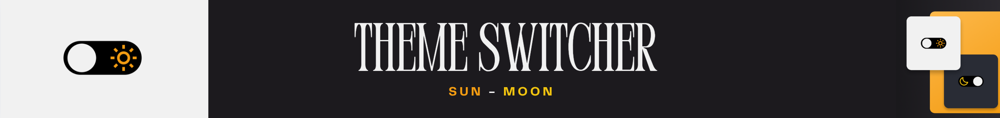

  

---

> ### **Seletor de Temas**

  

    Este é um projeto prático criado para exercitar e fixar os conhecimentos de HTML e CSS adquiridos durante a formação Discover da Rocketseat.
  

  <a href="https://www.figma.com/community/file/1241117469370182245/theme-switcher-desafio-discover">
    
    
<strong>Layout</strong>

  </a>

**Índice:**

  - [X] [O guia estelar de HTML](https://app.rocketseat.com.br/node/o-guia-estelar-de-html)
  - [X] [O guia estelar de CSS](https://app.rocketseat.com.br/node/o-guia-estelar-de-css)
  - [X] [Pilotando com a DOM](https://app.rocketseat.com.br/node/pilotando-com-a-dom)

  <a href="https://efficient-sloth-d85.notion.site/Desafio-Theme-Switcher-dbabdf77f70d43298df382c8e805fc13">
    
    
<strong>Instruções</strong>

  </a>

  

    <strong>Ferramentas:</strong> VScode, Git, HTML, CSS
  

---

Feito com ❤ by Igor 🖖
